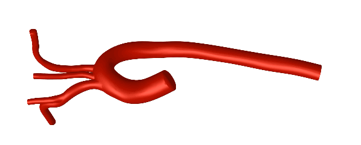
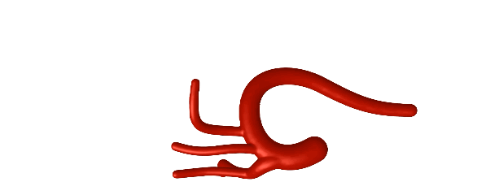

# dEVE_bench
Collection of benchmark environments based on [dEVE - digital Endovascular Environment](https://github.com/lkarstensen/eve) for research in robotic endovascular interventions. 

## Getting Started

1. Setup [dEVE](https://github.com/lkarstensen/eve?tab=readme-ov-file#getting-started) (including Sofa)
2. Install dEVE_bench package
   ```
   python3 -m pip install -e .
   ```
3. Test the installation
    ```
    python3 examples/function_check.py
    ```


## Benchmark Environments


|               |                                                    |
| ------------- | -------------------------------------------------- |
| BasicWireNav  |   |
| ArchVariety   |    |
| DualDeviceNav |  |

## How to use
This collection implements *interventions* of the EVE framework. 

You can use the intervention directly if you add a visualization from EVE. Look [here](https://github.com/lkarstensen/eve_bench/tree/main/example) to find examples how to add the visualization. 

To be used as gymnasium Env you need to add observation, reward, terminal and truncation from EVE. Look [here](https://github.com/lkarstensen/eve_training/tree/main/eve_training) to find examples how to use the benchmark environments in an reinforcement learning setup. 

## Other

We are still searching for good naming. Best option so far:

* **E**ndo**v**ascular **E**nvironment (EVE)

The alternatives so far maybe shouldn't be used:

* **Auto**nomous **E**ndovascular **Ro**bo**tic**s Benchmark (AutoERotic Benchmark)
* **A**utonomous **E**ndovascular **Rob**ot**ics** Benchmark (Aerobics Benchmark)
